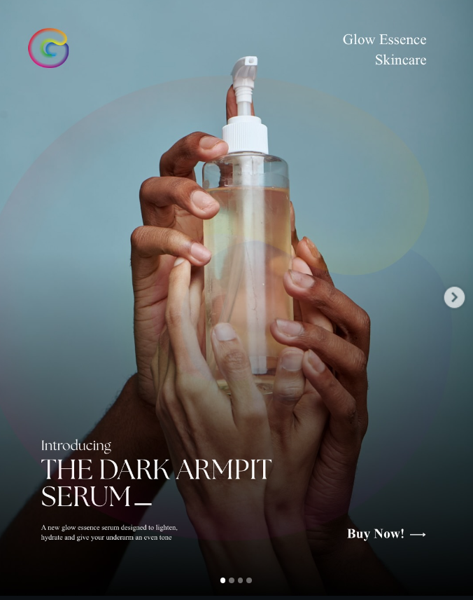
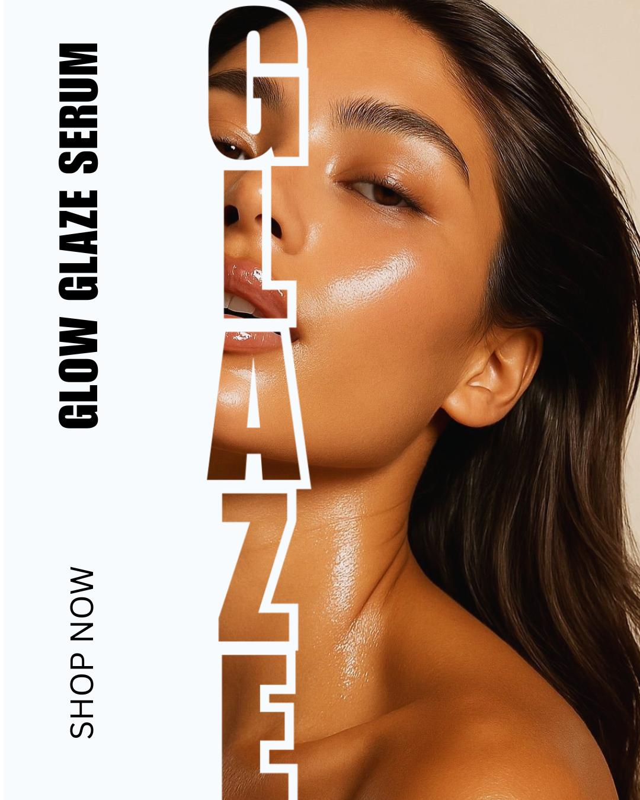

# Glow Essentials — Beauty & Skincare Marketing

## Project Type

Social Media Design • Beauty & Skincare Marketing

## Overview

A social media design series created for a beauty and skincare brand, using clean compositions and product-focused visuals to communicate the brand and its offerings.

## Creative Focus

- Product presentation
- Beauty and skincare marketing
- Social media visual direction
- Promotional content
- Editorial-style layouts

## Design Approach

The designs use strong typography, beauty-focused imagery and clean compositions to keep the products at the centre of the content while creating a polished and engaging visual presence.

## Selected Work

### Skincare Campaign

### Skincare Social Media Design

## Tools

Canva
